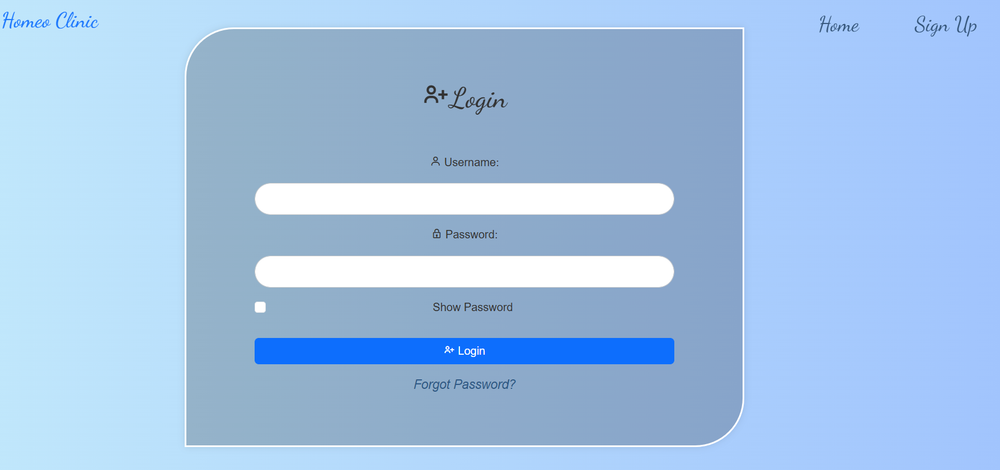
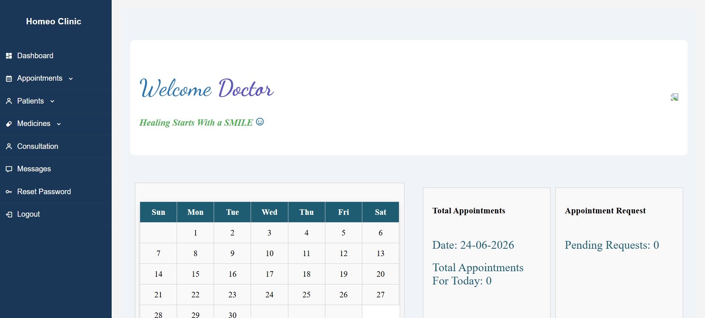
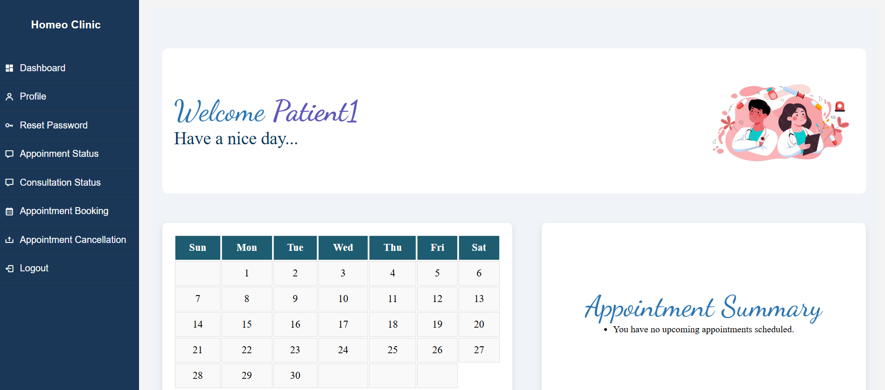

# Homeopathic Clinic Management System

A web-based clinic management system developed using **PHP** and **MySQL** to streamline the day-to-day operations of a homeopathic clinic. The system enables patients to book appointments online, while doctors can manage consultations, maintain patient records, prescribe medicines, and generate bills.

## Project Overview

This application digitizes clinic workflows by providing separate interfaces for patients and doctors. It reduces manual record-keeping and improves appointment management through an easy-to-use web interface.

## Features

### Patient Module

* User registration and login
* Online appointment booking
* Appointment cancellation
* View consultation history
* Access prescribed medicines and treatment details

### Doctor Module

* Secure doctor login
* Approve or reject appointment requests
* Record patient vitals and treatment history
* Prescribe medicines
* Manage medicine inventory
* Generate consultation bills

### Clinic Information

* Home page
* About Us page
* Services page
* Contact page with location details

### Additional Features

* Responsive user interface
* Database-driven record management
* Simple and user-friendly navigation

## Tech Stack

| Technology | Usage                         |
| ---------- | ----------------------------- |
| PHP        | Backend Development           |
| MySQL      | Database Management           |
| HTML       | Structure                     |
| CSS        | Styling                       |
| Bootstrap  | Responsive Design             |
| JavaScript | Client-side Functionality     |
| XAMPP      | Local Development Environment |

## Project Structure

```text
minipro/
├── home/
├── signlog/
├── appt/
├── docdash/
├── patdash/
├── screenshots/
├── miniprjct.sql
└── README.md
```

## Installation & Setup

### Prerequisites

* XAMPP
* PHP
* MySQL
* Web Browser

### Steps

1. Clone the repository:

```bash
git clone https://github.com/your-username/homeopathic-clinic-management-system.git
```

2. Move the project folder into:

```text
C:\xampp\htdocs\
```

3. Start **Apache** and **MySQL** using XAMPP Control Panel.

4. Open:

```text
http://localhost/phpmyadmin
```

5. Create a database named:

```text
miniprjct
```

6. Import the file:

```text
miniprjct.sql
```

7. Open the application:

```text
http://localhost/minipro/home
```

## Demo Credentials

### Doctor Account

Email: [doc12@gmail.com](mailto:doc12@gmail.com)

Password: Doc@123

### Patient Account

Email: [patient12@gmail.com](mailto:patient12@gmail.com)

Password: Password@123

## Screenshots

### Home Page


### Login Page



### Doctor Dashboard



### Patient Dashboard



## Future Enhancements

* Online payment integration
* Email and SMS appointment reminders
* Telemedicine consultation support
* Medical report generation
* Advanced analytics dashboard
* Mobile application support

## Learning Outcomes

This project helped in understanding:

* Full-stack web development
* PHP and MySQL integration
* CRUD operations
* Authentication and session management
* Database design
* Responsive web design

## Author

**Aparna Prasad**

## License

This project is developed for educational and academic purposes.
